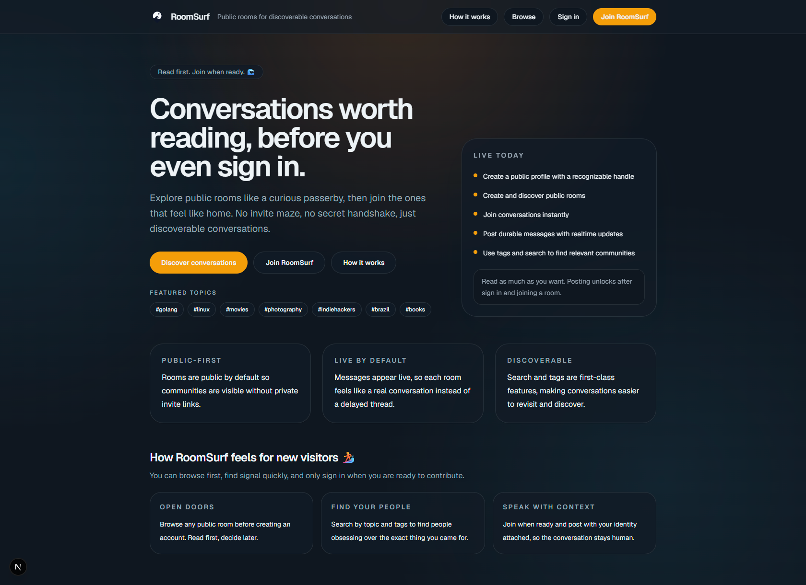

# RoomSurf 🏄

Hosted at:

https://room.surf

Public-first chat for discoverable conversations.

Imagine Reddit if every post were a live chat room.

Instead of private servers, conversations happen in public rooms that anyone can discover and join.

RoomSurf is the official hosted deployment of the OpenChat open-source project.

RoomSurf is powered by the OpenChat open-source project. It is the live instance built around that product direction.

---

[](https://github.com/eliasfeijo/open-chat)
[](https://nextjs.org)
[](https://www.typescriptlang.org)
[](https://www.postgresql.org)
[](https://upstash.com)
[](https://orm.drizzle.team)
[](CONTRIBUTING.md)
[](LICENSE)

## Live Demo


## Product Preview

Homepage screenshot:



OpenGraph image for social sharing and link previews:


---

## Project Status

RoomSurf is in active MVP development.

Core realtime public rooms are implemented. The current focus is stabilizing the public-room experience before expanding into moderation, notifications, and richer community features.

---

## Why We Believe Public Conversations Matter

The web became valuable because knowledge was linkable, searchable, and public.

Today, much of the internet's knowledge lives inside Discord servers, Slack workspaces, WhatsApp groups, and private communities. Search engines cannot see it, links cannot reference it, and great discussions disappear over time.

RoomSurf is an experiment in reversing that trend.

Not every conversation should be public, but public conversations should be easy to create, discover, and preserve.

---

## Why RoomSurf?

Most online conversations are now trapped behind invite links and private workspaces.

That creates three problems:

- great discussions are hard to discover
- search engines cannot index most community knowledge
- joining a community usually requires social access first

RoomSurf exists to make communities public by default.

---

## Philosophy

RoomSurf is opinionated.

- rooms are public
- discovery matters
- search is a core feature
- knowledge should remain linkable
- realtime should stay simple
- architecture should stay readable
- features should be added slowly and deliberately

---

## Who is RoomSurf for?

RoomSurf is designed for communities that benefit from public, searchable, live discussion.

- developer communities
- local communities
- hobby groups
- open-source projects
- study groups

---

## MVP: What Works Today

The initial product scope is intentionally narrow.

Available now:

- [x] create an account and authenticate
- [x] set up and edit a profile
- [x] create public rooms with name, description, topic, and tags
- [x] browse and search rooms
- [x] join and leave rooms
- [x] send durable messages
- [x] receive live room message updates
- [x] see active room presence counts

Explicitly not in V1:

- [ ] private messages
- [ ] threads
- [ ] reactions
- [ ] uploads
- [ ] voice and video
- [ ] bots
- [ ] moderation systems
- [ ] notifications
- [ ] federation

---

## Why Not Discord Or Reddit?

RoomSurf is not trying to replace everything. It focuses on public, discoverable, live conversations.

| Capability                     | Discord | Reddit | RoomSurf |
| ------------------------------ | ------- | ------ | -------- |
| Public discovery by default    | No      | Yes    | Yes      |
| Live chat in rooms             | Yes     | No     | Yes      |
| Searchable room communities    | Limited | Yes    | Yes      |
| Invite required to participate | Usually | No     | No       |

---

## What's Next

Areas currently being refined:

- stronger homepage hero focused on public, discoverable conversations
- richer empty states with seed-room ideas
- stronger visual emphasis on tags during room creation
- higher-signal room cards with activity and presence context

---

## OpenChat And RoomSurf

OpenChat is the open-source project in this repository.

RoomSurf is the official hosted deployment running at [room.surf](https://room.surf).

This repository is intentionally still named `open-chat` because the product brand and the repository identity are separate concerns.

---

## Architecture

### At A Glance

OpenChat, the open-source project, intentionally optimizes for:

- maintainability
- clarity
- simplicity
- incremental evolution
- AI-assisted development
- low operational overhead

The project does not optimize for premature scale or premature architectural flexibility.

Core rules:

- modular monolith
- PostgreSQL as the source of truth
- Redis only for ephemeral state
- business logic independent from frameworks
- feature ownership over generic technical folders
- explicit code over hidden behavior

---

### Technology Stack

Frontend:

- Next.js App Router
- React
- TypeScript
- Tailwind CSS
- shadcn/ui
- TanStack Query
- Zustand
- React Hook Form

Backend:

- Next.js Route Handlers
- Server Actions
- Native WebSockets

Platform and data:

- Better Auth
- Zod
- PostgreSQL
- Drizzle ORM
- Redis

Testing:

- Vitest
- Playwright

Deployment:

- Single long-running Node.js application host
- Managed PostgreSQL
- Upstash Redis
- Reverse proxy such as Caddy or Nginx

---

### Repository Shape (Contributor View)

```text
src/
	app/
	modules/
		auth/
		users/
		rooms/
		tags/
		messages/
		search/
	db/
	lib/
	shared/
	websocket/
```

Modules own their own domain, application, infrastructure, presentation, and validation surfaces.

---

### Documentation

Canonical documentation lives in:

- docs/architecture.md
- docs/roadmap.md
- docs/deployment.md
- docs/adr/0001-modular-monolith.md
- docs/adr/0002-tech-stack.md
- docs/adr/0003-realtime.md
- docs/adr/0004-data-storage.md

Additional contributor references:

- docs/project-principles.md
- docs/coding-standards.md
- docs/domain-model.md

Read the architecture and ADR set before changing architectural direction.

---

## Contributing

Open a discussion or pull request if you want to contribute to product direction, architecture, or implementation.

- contributor guide: [CONTRIBUTING.md](CONTRIBUTING.md)
- architecture: [docs/architecture.md](docs/architecture.md)
- coding standards: [docs/coding-standards.md](docs/coding-standards.md)
- project principles: [docs/project-principles.md](docs/project-principles.md)

### AI Contribution

This repository is designed for AI-assisted development.

Before generating code, review:

- AGENTS.md
- .github/copilot-instructions.md
- docs/architecture.md
- docs/project-principles.md

AI assistants should implement within the documented architecture and must not invent new architectural patterns.

---

## Development

Prerequisites:

- Node.js 20.9 or newer
- pnpm 11.17 or newer

Install dependencies:

```bash
pnpm install
```

Create a local environment file by copying `.env.example` to `.env`.

Use the equivalent command for your shell, for example `cp .env.example .env` or `copy .env.example .env`.

Start local infrastructure:

```bash
pnpm local:services:up
```

Apply generated database migrations:

```bash
pnpm db:migrate
```

The repository now includes a local Docker Compose stack for:

- PostgreSQL on `localhost:5432`
- Redis on `localhost:6379`

Current scope note:

- PostgreSQL is required for the current database, auth, and users foundation.
- The current realtime slice uses Redis for ephemeral room typing state and PostgreSQL for durable messages.
- The current Redis adapter reads `UPSTASH_REDIS_REST_URL` and `UPSTASH_REDIS_REST_TOKEN` through the Upstash REST client.
- Local Docker Redis is available for infrastructure parity, but the current repository code path expects the Upstash REST-style environment contract.

Production deployment note:

- The current realtime slice starts a long-running WebSocket listener at application startup.
- Live room message updates are published only after successful PostgreSQL persistence.
- Room presence currently reports room-scoped active participant counts from the single-instance in-memory subscription hub.
- Typing indicators are ephemeral, room-scoped, and backed by Redis plus WebSocket broadcasts.
- Prefer a single-VM or equivalent long-running Node.js host with Caddy or Nginx in front.
- See [docs/deployment.md](docs/deployment.md) for the recommended single-instance deployment pattern and CI/CD direction.

Run the development server:

```bash
pnpm dev
```

View local service logs:

```bash
pnpm local:services:logs
```

Stop local infrastructure:

```bash
pnpm local:services:down
```

Reset local infrastructure volumes:

```bash
pnpm local:services:reset
```

Run the baseline validation checks:

```bash
pnpm lint
pnpm typecheck
pnpm test
pnpm build
```

Run end-to-end tests:

```bash
pnpm test:e2e
```

Generate database migrations after schema changes:

```bash
pnpm db:generate
```

Apply generated migrations to the configured database:

```bash
pnpm db:migrate
```

Recommended local workflow for new backend slices:

1. Start local services with `pnpm local:services:up`.
2. Apply migrations with `pnpm db:migrate`.
3. Run the app on the host with `pnpm dev`.
4. Generate migrations after schema changes with `pnpm db:generate`.
5. Re-apply migrations with `pnpm db:migrate`.
6. Run `pnpm lint`, `pnpm typecheck`, `pnpm test`, and `pnpm build` before closing a slice.

This keeps frontend and server iteration fast while still making PostgreSQL and Redis reproducible across local environments.

---

## First Commit Baseline

The initial scaffold is expected to provide:

- Next.js App Router application under `src/app`
- feature-first module structure under `src/modules`
- shared configuration and environment contracts
- Vitest and Playwright baseline test setup
- Drizzle migration generation configuration
- documentation and ADRs aligned with the intended architecture

The first functional application slices should build on this baseline instead of reshaping it.
