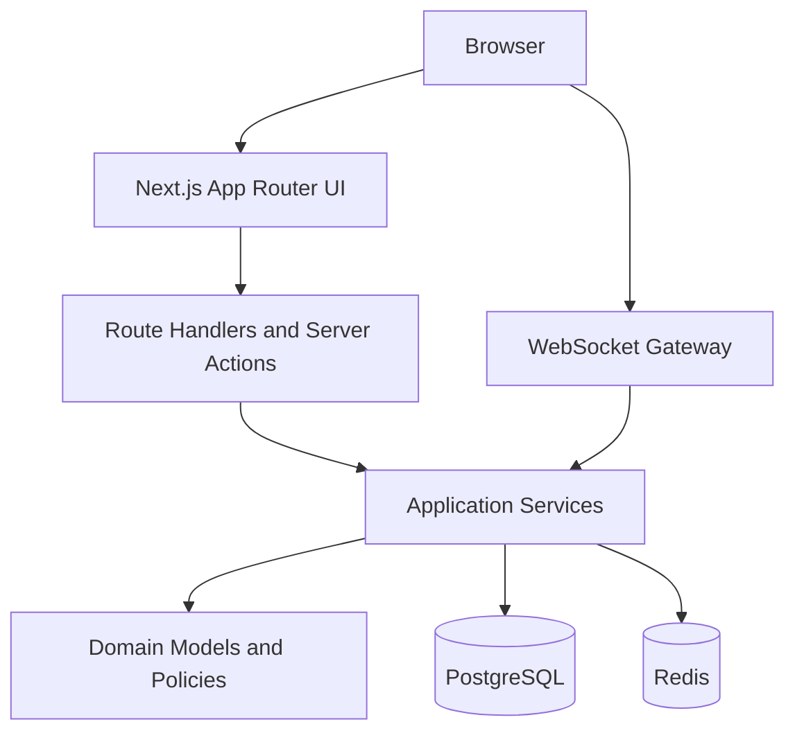
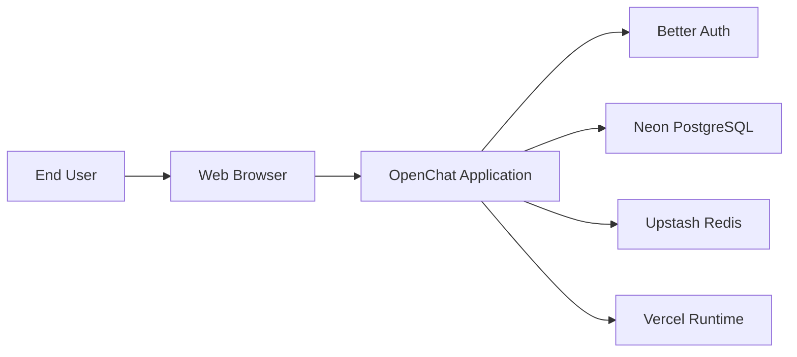
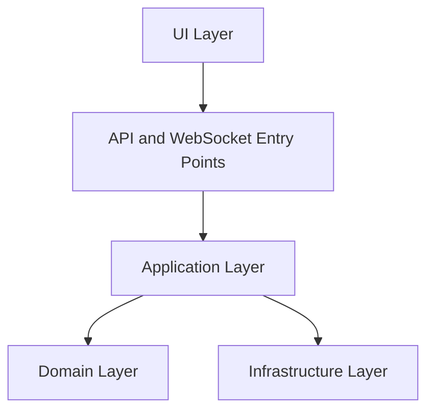

# OpenChat Architecture

## Document Status

This document is the canonical architecture reference for OpenChat.

All implementation work must conform to the rules defined here unless a later ADR supersedes part of this document.

The target audience is engineers and AI coding assistants that need explicit boundaries, rules, and rationale.

---

## Vision

OpenChat is a public chat platform built for discoverable conversations.

The product goal is not to replicate closed-community platforms. It is to provide lightweight public rooms that are easy to create, easy to browse, and easy to search.

The architecture is intentionally optimized for maintainability, clarity, and incremental delivery. It must stay understandable to a small team and predictable for AI-assisted development.

The MVP should feel closer to Reddit meets IRC than to a full collaboration suite.

---

## Goals

- Support public rooms with names, descriptions, topics, and tags.
- Allow authenticated users to join rooms, leave rooms, and send messages.
- Show online users and basic presence in active rooms.
- Make rooms searchable from the first version.
- Keep the architecture simple enough that a new engineer can understand it quickly.
- Keep module boundaries explicit so AI tools generate code that stays consistent.
- Use one primary implementation language across frontend and backend.

## Non-Goals

- No private messaging in V1.
- No threads in V1.
- No reactions in V1.
- No file uploads in V1.
- No voice or video in V1.
- No bots or plugin system in V1.
- No federation in V1.
- No event bus, CQRS, or microservices in V1.
- No architecture designed around massive global scale before product fit exists.

Why these non-goals matter: every excluded feature removes architectural pressure that would otherwise push the codebase toward premature abstraction.

---

## Architectural Principles

The architecture is governed by the following invariants.

1. Modular monolith first.
2. PostgreSQL is the source of truth.
3. Redis stores only ephemeral or derived state.
4. Business logic must not depend on Next.js, React, WebSocket implementations, or Drizzle details.
5. Every feature owns its domain, application, infrastructure, API, and validation logic.
6. Cross-module dependencies are allowed only through explicit application-facing contracts.
7. External input is never trusted and is always validated with Zod.
8. Small files and small functions are preferred over large services.
9. Explicit code is preferred over clever abstractions.
10. ADRs are the mechanism for architectural change.

Forbidden patterns:

- Business logic inside React components.
- Business logic inside route handlers.
- Business logic inside WebSocket gateway handlers.
- Business logic inside repositories.
- Cross-module imports into another module's infrastructure layer.
- Redis used as durable message storage.
- Framework-specific types leaking into the domain layer.
- Generic `Error` for domain failures.

Trade-off: these rules create more files and more explicit seams, but they reduce ambiguity and make maintenance safer.

---

## High-Level Architecture

OpenChat is a single deployable application composed of feature modules and shared infrastructure.



Why: the system needs one coherent runtime model, one database, and one deployable unit during the MVP.

How: Next.js hosts both the web application and the server-side entry points. Domain rules live in feature modules. PostgreSQL stores durable data. Redis supports presence, subscriptions, and transient coordination.

Trade-offs: a monolith provides less hard isolation than microservices, but it is significantly easier to evolve while requirements are still fluid.

Future evolution: when product boundaries stabilize, selected capabilities can be extracted, but the default assumption is that they remain in-process.

---

## System Context

The system interacts with four main external actors and services.



Actors and responsibilities:

- End users browse rooms, authenticate, join rooms, and exchange messages.
- Better Auth manages authentication flows and session primitives.
- PostgreSQL stores durable application data.
- Redis coordinates ephemeral state across connections and instances.
- Vercel hosts the deployed application runtime.

Architectural consequence: all external dependencies are behind application or infrastructure boundaries. The rest of the system should not be aware of vendor-specific behavior.

---

## Module Organization

Code is organized by feature, not by technical layer at the repository root.

Canonical structure:

```text
src/
	app/
	modules/
		auth/
		users/
		rooms/
		tags/
		messages/
		search/
	db/
	lib/
	shared/
	websocket/
```

Canonical structure inside a module:

```text
rooms/
	domain/
	application/
	infrastructure/
	api/
	validation.ts
```

Module ownership rules:

- `auth` owns authentication workflows and session-facing policies.
- `users` owns profile data and user-facing identity metadata.
- `rooms` owns room creation, editing, membership rules, topics, and room-tag assignment orchestration.
- `tags` owns tag vocabulary and tag lookup behavior.
- `messages` owns message creation, retrieval, and message visibility rules.
- `search` owns room search queries and search-specific ranking logic.

Why: feature ownership keeps related behavior together and avoids the growth of generic shared service layers.

Trade-off: some duplication between modules is acceptable when it preserves isolation and readability.

Future evolution: if a module becomes too large, split it into smaller sub-features before creating new cross-cutting abstractions.

---

## Layer Responsibilities

Every module follows the same layer model.



Layer definitions:

- Domain: business concepts, invariants, value objects, and domain-specific errors.
- Application: use cases, orchestration, transactions, authorization checks, and coordination between domain and infrastructure.
- Infrastructure: repositories, database mappings, Redis adapters, and external service adapters.
- API: route handlers, request/response mapping, and transport-specific validation.
- UI: rendering, user interaction, view composition, and client-side behavior.

Rule: dependencies flow inward. Outer layers may depend on inner layers. Inner layers must not depend on outer layers.

---

## Dependency Rules

Dependency rules are strict because they are the main mechanism that prevents architectural drift.

Allowed dependencies:

- UI may call API endpoints, server actions, or query hooks.
- API may depend on application services and validation schemas.
- Application may depend on domain logic, repository interfaces, and infrastructure implementations selected at composition boundaries.
- Infrastructure may depend on database clients, Redis clients, and shared technical utilities.
- Shared utilities may not contain business rules.

Disallowed dependencies:

- Domain importing React, Next.js, Drizzle, or Redis packages.
- Route handlers importing another module's repositories.
- One module importing another module's infrastructure folder.
- UI importing database code.
- WebSocket handlers calling repositories directly.

Naming rule: use explicit action-oriented names such as `createRoom`, `joinRoom`, `leaveRoom`, `sendMessage`, and `searchRooms`.

File-size rule: prefer files under roughly 300 lines and functions under roughly 40 lines when practical.

---

## Domain Layer

Why: the domain layer protects business rules from framework churn and infrastructure changes.

What belongs here:

- Entities and value objects that express the language of the module.
- Invariants such as room name limits, slug rules, membership constraints, and message content rules.
- Domain-specific errors such as `RoomNotFoundError` or `UserAlreadyJoinedError`.
- Pure policy functions that can be tested without databases or network access.

What does not belong here:

- SQL queries.
- HTTP request parsing.
- WebSocket connection state.
- Cache invalidation.

Trade-off: domain models require deliberate design, but they make core behavior easier to test and safer to reuse.

Future evolution: if richer moderation or permissions arrive later, domain policies expand before transport code changes.

---

## Application Layer

Why: application services define the system behavior users actually invoke.

Responsibilities:

- Execute one use case per entry point.
- Validate preconditions that require data access.
- Coordinate domain rules with repositories.
- Open and control transactions.
- Publish durable outcomes to callers and ephemeral updates to realtime infrastructure.
- Enforce authorization rules.

Expected shape:

- One file per use case when practical.
- Inputs expressed as typed command or query objects.
- Outputs expressed as explicit DTOs.
- No framework request or response objects.

Examples:

- `create-room.ts`
- `join-room.ts`
- `leave-room.ts`
- `send-message.ts`
- `search-rooms.ts`

Trade-off: many small use-case files create more surface area, but they are easier for humans and AI tools to understand correctly.

---

## Infrastructure Layer

Why: infrastructure isolates external systems and keeps the rest of the codebase stable.

Responsibilities:

- Persist and query durable data with Drizzle ORM.
- Read and write ephemeral state in Redis.
- Adapt Better Auth session information into application-facing data.
- Map database records into domain-safe shapes.

Rules:

- Repositories may enforce persistence constraints, but not business policy.
- Infrastructure code may optimize queries, but must not change use-case semantics.
- Infrastructure interfaces should be simple and use application-friendly types.

Trade-off: some mapping code is unavoidable. That explicit mapping is preferred over letting ORM models leak across layers.

Future evolution: introduce read-optimized infrastructure only when search or message history proves it necessary.

---

## API Layer

The API layer includes Next.js route handlers and server actions used as transport entry points.

Why: transport code must stay thin so that HTTP concerns do not pollute business logic.

Responsibilities:

- Parse requests.
- Validate external input with Zod.
- Resolve authenticated user context.
- Call exactly one application use case or a small orchestration wrapper.
- Map typed results or errors into HTTP responses.

Forbidden behavior:

- Direct SQL access.
- Direct Redis access.
- Inline authorization logic beyond basic authentication presence checks.
- Business rule branches encoded in route handlers.

Future evolution: server actions are acceptable for tightly coupled UI mutations, but they must still call application services instead of embedding rules.

---

## UI Layer

The UI is built with Next.js App Router, React, Tailwind CSS, and shadcn/ui.

Why: the chosen stack provides a productive TypeScript-first workflow, good server-rendering support, and strong AI tooling performance.

Responsibilities:

- Render room discovery, room details, membership state, and message timelines.
- Manage forms and client interaction.
- Subscribe to realtime updates and update visible state.

Client-state rules:

- Server state belongs in TanStack Query.
- Local interaction state belongs in local component state or Zustand only when shared client state is required.
- Form state belongs in React Hook Form.
- UI components must not implement business rules.

Trade-off: adding dedicated state libraries increases the dependency surface, but it creates clear separation between server data, local UI state, and form concerns.

---

## Authentication

Better Auth is the canonical authentication solution.

Why: OpenChat needs a modern Next.js-compatible authentication system with minimal custom auth logic and a good TypeScript experience.

How authentication works:

- Users authenticate through Better Auth.
- Session material is verified at the application boundary.
- Application services receive a normalized authenticated-user context rather than raw provider payloads.
- Anonymous read access may exist for public room browsing, but write actions require authentication.

Rule: authentication identity is infrastructure input, not a domain concept.

Future evolution: additional providers can be added without changing room or message business logic.

---

## Authorization

Authorization is application-layer policy.

Baseline rules for the MVP:

- Any authenticated user may create a room.
- Only room owners may edit room metadata.
- Any authenticated user may join or leave a public room.
- Only room members may send messages to that room.
- Any authenticated user may edit their own profile.
- Public room browsing and room search may be available without authentication.

Why: these rules are simple, explicit, and sufficient for the initial product scope.

Trade-off: coarse authorization is easier to reason about now, but future moderation or role systems will require finer-grained policy objects.

---

## Realtime Communication

Native WebSockets are the canonical realtime transport.

Why: modern browsers support WebSockets well, and the MVP does not need fallback transports or the additional abstraction of Socket.IO.

Connection model:

- The client establishes a WebSocket connection after authentication state is available.
- The gateway authenticates the connection and binds it to a user identity.
- The client subscribes to room channels.
- The gateway forwards validated events into application services when business changes are required.
- The gateway broadcasts room-scoped events for new messages, presence, and typing state.

Rules:

- The gateway manages connection state, subscriptions, and transport serialization.
- Business rules remain in application services.
- Durable message creation always persists to PostgreSQL before broadcast acknowledgment.
- Presence and typing state may be transient and Redis-backed.

Trade-off: native WebSockets require more explicit protocol design than Socket.IO, but that explicitness aligns with the project philosophy.

Future evolution: multi-instance fan-out can use Redis pub/sub while preserving PostgreSQL as the durable source of truth.

---

## Data Persistence

PostgreSQL is the system of record.

Core tables in the MVP:

- `users`
- `rooms`
- `room_members`
- `messages`
- `tags`
- `room_tags`
- auth-related session tables managed alongside application data as needed

Why: the domain is relational, consistency matters, and PostgreSQL offers reliable transactions plus built-in full-text search for the initial search scope.

Rules:

- Durable state is written to PostgreSQL first.
- Redis may cache or mirror durable state temporarily, but PostgreSQL remains authoritative.
- Schema changes must be tracked through explicit migrations.

Trade-off: a relational schema requires deliberate migrations, but it keeps the system understandable and queryable.

---

## Database Design Philosophy

The schema should model business concepts directly rather than hiding them behind generic extensibility mechanisms.

Principles:

- Prefer explicit tables over polymorphic storage.
- Prefer simple many-to-many join tables over serialized arrays.
- Keep message storage append-friendly.
- Add indexes only when a query pattern is known.
- Use soft-delete fields only when there is a defined product need.

Why: explicit schemas are easier to reason about, easier to migrate, and easier for AI tools to extend safely.

Future evolution: partition large message tables by time or room only when observed scale justifies the operational cost.

---

## Caching Strategy

Redis is used for ephemeral state and coordination, not for durable chat history.

Allowed Redis responsibilities:

- online user presence
- room presence summaries
- typing indicators
- connection-to-user mappings
- room subscription fan-out metadata
- short-lived caches for hot room discovery queries when necessary

Disallowed Redis responsibilities:

- durable message storage
- primary room metadata storage
- authoritative membership storage

Why: keeping Redis ephemeral prevents cache inconsistency from becoming a data integrity problem.

Trade-off: some reads may still hit PostgreSQL more often than a cache-heavy design, but correctness and simplicity are more important for the MVP.

---

## Search Strategy

Search starts with PostgreSQL full-text search.

Scope of V1 search:

- room names
- room descriptions
- room topics
- tags associated with rooms

Why: room search is required early, but the initial scale does not justify a dedicated search engine.

How:

- define clear ranking rules for room metadata
- keep searchable data normalized in PostgreSQL
- add indexes that support the actual search query plan

Trade-off: PostgreSQL search is less flexible than a specialized engine, but it avoids operational complexity and cross-system synchronization.

Future evolution: Meilisearch is the next likely step for richer relevance or typo tolerance. OpenSearch becomes reasonable only if scale and query sophistication demand it.

---

## Validation Strategy

Validation is mandatory at every external boundary.

Rules:

- Route handlers validate request params, query strings, headers when relevant, and bodies with Zod.
- WebSocket inbound events validate payloads with Zod before any application call.
- Application services may validate higher-level invariants that depend on existing data.
- Validation schemas live with the owning feature.

Why: input validation is both a correctness boundary and an architectural boundary.

Trade-off: explicit schemas add code, but they prevent transport concerns from leaking into core logic and give AI tools a reliable shape to follow.

---

## Error Handling

Errors are explicit and typed.

Rules:

- Domain failures use domain-specific error classes or discriminated error results.
- Application services translate infrastructure failures into application-safe failures.
- API and WebSocket layers map typed failures into transport responses.
- Generic `Error` must not be used for expected business conditions.

Why: explicit errors preserve intent and make logs, tests, and user-facing behavior predictable.

Trade-off: more error types require discipline, but the resulting system is easier to debug and safer to evolve.

---

## Logging

Logging must support debugging without leaking sensitive data.

Required logging characteristics:

- structured logs
- request and connection correlation identifiers
- user identifiers when safe and necessary
- room identifiers for room-scoped actions
- explicit event names for state-changing actions

Do not log:

- raw authentication secrets
- full session tokens
- message content by default in production logs
- personally sensitive fields unless operationally required

Why: logs should explain what happened, not become another data store.

---

## Observability

The MVP does not require a complex observability platform, but it does require measurable behavior.

Minimum expectations:

- request latency metrics
- database query timing visibility
- WebSocket connection counts
- room subscription counts
- message publish success and failure counts
- error-rate monitoring on route handlers and realtime handlers

Why: realtime systems fail in ways that are difficult to infer from user reports alone.

Future evolution: tracing across HTTP, WebSocket, PostgreSQL, and Redis is valuable once traffic or team size grows.

---

## Security Considerations

Security requirements for the MVP are explicit.

- Validate all external input with Zod.
- Treat all client-provided identifiers as untrusted.
- Enforce authorization in application services.
- Escape or sanitize any user-generated content according to rendering context.
- Apply rate limiting to authentication, room creation, and message submission paths.
- Protect WebSocket connection establishment against unauthorized use.
- Keep secrets in environment-managed configuration only.

Why: public chat products are naturally exposed to abuse and malformed input.

Trade-off: stricter validation and rate limiting may add friction during development, but they reduce avoidable production risk.

---

## Scalability Strategy

Scalability is incremental, not speculative.

Current target:

- thousands of concurrent users
- many public rooms
- active but not internet-scale write throughput

Strategy:

- start with one modular monolith deployment model
- use PostgreSQL indexes and query tuning first
- use Redis for ephemeral coordination and multi-instance fan-out
- keep room and message queries explicit and observable
- add dedicated search infrastructure only when PostgreSQL search becomes insufficient

Why: the primary risk is architectural complexity outrunning product maturity, not the reverse.

Future evolution: scaling steps should follow measured bottlenecks and be captured in ADRs.

---

## Future Evolution

Future features are allowed only when they extend the current architecture rather than forcing a rewrite.

Likely near-term additions:

- richer profiles
- presence improvements
- typing indicators
- room moderation
- pinned messages
- mentions

Likely later additions:

- attachments backed by object storage
- dedicated search engine
- notification delivery
- private rooms or access tiers

Rules for future change:

- new features must declare module ownership
- new infrastructure must justify operational cost
- new cross-cutting abstractions require an ADR
- no feature may bypass validation or application-layer authorization

---

## Architectural Constraints

These constraints are mandatory until changed by ADR.

- TypeScript is used across the application.
- Next.js App Router is the web framework.
- Route handlers and server actions stay thin.
- Native WebSockets are the realtime transport.
- Drizzle ORM is the database access layer.
- PostgreSQL is the durable store.
- Redis is ephemeral only.
- Zod validates all external input.
- Business logic lives in application services and domain code.
- Modules own their internal layers.
- AI assistants implement within these rules and must not invent new architecture.

This architecture deliberately favors clarity over flexibility. That is a feature, not a temporary compromise.
